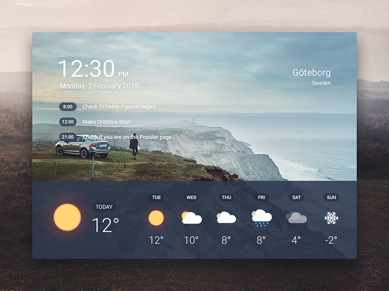
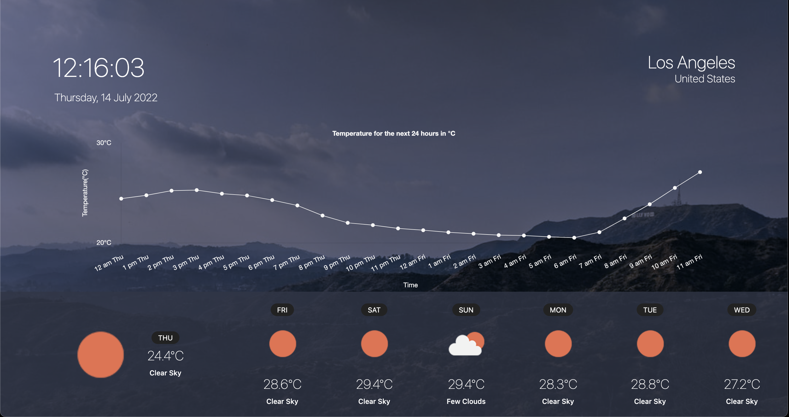

## A simple weather app

## inspiration 
The UI is inspired by this image I found while searching google.

## How to use
1. Open the app using the url [Weather App](https://mylocationweather.netlify.app/)
2. view the weather information for the day and the next 6 days

## features
- View the weather information for the day 
- View the weather information for the week
- Display the time and date
- Display the user location
- Display the background image of the location the user is in (for example, in the preview image below, the background image is the one for the observatory in thecity of Los Angeles)
- View 24 hours forecast as a graph

## Tools used
- HTML
- CSS (SCSS)
- JavaScript
- Weather API from [OpenWeatherMap](https://openweathermap.org/)

## Preview of the App

